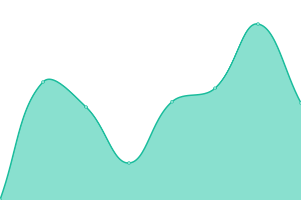

# [📈 Live Status](https://luma-care.github.io/uptime-monitoring): <!--live status--> **🟩 All systems operational**

This repository contains the open-source uptime monitor and status page for [Luma Care](https://luma-care.github.io/uptime-monitoring), powered by [Upptime](https://github.com/upptime/upptime).

With [Upptime](https://upptime.js.org), you can get your own unlimited and free uptime monitor and status page, powered entirely by a GitHub repository. We use [Issues](https://github.com/luma-care/uptime-monitoring/issues) as incident reports, [Actions](https://github.com/luma-care/uptime-monitoring/actions) as uptime monitors, and [Pages](https://luma-care.github.io/uptime-monitoring) for the status page.

<!--start: status pages-->
<!-- This summary is generated by Upptime (https://github.com/upptime/upptime) -->
<!-- Do not edit this manually, your changes will be overwritten -->
<!-- prettier-ignore -->
| URL | Status | History | Response Time | Uptime |
| --- | ------ | ------- | ------------- | ------ |
|  LUMA Health | 🟩 Up | [luma-health.yml](https://github.com/luma-care/uptime-monitoring/commits/HEAD/history/luma-health.yml) | 

 378ms
     
 | 

<a href="https://luma-care.github.io/uptime-monitoring/history/luma-health">100.00%</a>
    

|  LUMA Travel | 🟩 Up | [luma-travel.yml](https://github.com/luma-care/uptime-monitoring/commits/HEAD/history/luma-travel.yml) | 

 1616ms
     
 | 

<a href="https://luma-care.github.io/uptime-monitoring/history/luma-travel">100.00%</a>
    

|  LUMA Quote | 🟩 Up | [luma-quote.yml](https://github.com/luma-care/uptime-monitoring/commits/HEAD/history/luma-quote.yml) | 

 168ms
     
 | 

<a href="https://luma-care.github.io/uptime-monitoring/history/luma-quote">100.00%</a>
    

|  LuMagic | 🟩 Up | [lu-magic.yml](https://github.com/luma-care/uptime-monitoring/commits/HEAD/history/lu-magic.yml) | 

 802ms
     
 | 

<a href="https://luma-care.github.io/uptime-monitoring/history/lu-magic">100.00%</a>
    

|  LUMA Online Service | 🟩 Up | [luma-online-service.yml](https://github.com/luma-care/uptime-monitoring/commits/HEAD/history/luma-online-service.yml) | 

 188ms
     
 | 

<a href="https://luma-care.github.io/uptime-monitoring/history/luma-online-service">100.00%</a>
    

|  Lumagix API | 🟩 Up | [lumagix-api.yml](https://github.com/luma-care/uptime-monitoring/commits/HEAD/history/lumagix-api.yml) | 

 769ms
     
 | 

<a href="https://luma-care.github.io/uptime-monitoring/history/lumagix-api">100.00%</a>
    

<!--end: status pages-->

[**Visit our status website →**](https://luma-care.github.io/uptime-monitoring)

## 📄 License

- Powered by: [Upptime](https://github.com/upptime/upptime)
- Code: [MIT](./LICENSE) © [Anand Chowdhary](https://anandchowdhary.com), supported by [Pabio](https://pabio.com)
- Data in the `./history` directory: [Open Database License](https://opendatacommons.org/licenses/odbl/1-0/)
